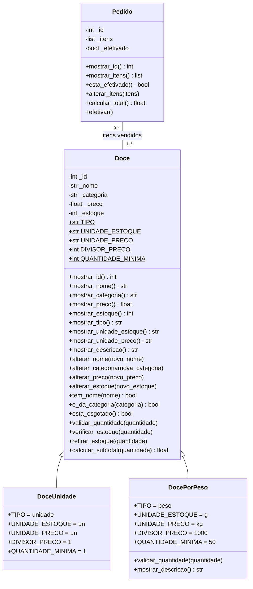

# Doceria API

API para o projeto de doceria. Este repositório ainda está no estágio de estrutura inicial: os arquivos da aplicação, das dependências e dos testes estão vazios. Por isso, não há endpoints, entidades, regras de negócio ou comandos de execução implementados para documentar neste momento.

## Estado atual

- Linguagem identificada pela estrutura do projeto: Python.
- Os pacotes estão organizados em rotas, controllers, models e data.
- `requirements.txt` ainda não declara dependências.
- `main.py`, `testar_rotas.py` e `verificar.py` ainda não possuem implementação.

## Diagrama de classes

Diagrama UML das classes de domínio da **Doceria API** (`app/models/`): `Doce`, `DoceUnidade`, `DocePorPeso` e `Pedido`.

> O diagrama documenta o modelo de domínio pretendido. As classes ainda não estão implementadas nos arquivos do projeto.

Convenção de visibilidade usada:

- `+` público
- `-` protegido (atributos com um sublinhado no código, como `_nome`)
- `$` constante de classe



## Relações

- **Herança** (triângulo vazio): `DoceUnidade` e `DocePorPeso` herdam de `Doce`. As filhas mudam as constantes de classe; `DocePorPeso` ainda sobrescreve `validar_quantidade()` e `mostrar_descricao()`, chamando `super()`.
- **Associação** `Pedido` — `Doce`:
  - Um `Pedido` tem **1 ou mais** doces (`1..*`): pedido vazio é recusado em `Pedido.alterar_itens()`.
  - Um `Doce` aparece em **0 ou mais** pedidos (`0..*`): um doce pode nunca ter sido vendido.
  - O pedido guarda os próprios objetos `Doce`, junto com a quantidade vendida de cada um. Não é composição, porque o doce existe sem o pedido e continua existindo depois dele.

## Estrutura do projeto

```text
.
├── app/
│   ├── controllers/   # Camada prevista para coordenação das regras da aplicação
│   ├── data/          # Camada prevista para acesso ou preparação de dados
│   ├── models/        # Camada prevista para os modelos do domínio
│   └── routes/        # Camada prevista para as rotas da API
├── main.py            # Ponto de entrada previsto
├── requirements.txt   # Dependências Python do projeto
├── testar_rotas.py    # Arquivo previsto para testes de rotas
└── verificar.py       # Script de verificação previsto
```

As responsabilidades descritas para as pastas são propostas com base em seus nomes; ainda não há código implementado que as confirme.

## Requisitos

- Python 3 instalado.

Ainda não é possível iniciar a API ou executar testes: não há implementação de aplicação, dependências declaradas nem casos de teste. Quando esses componentes forem adicionados, documente aqui a versão de Python suportada, os passos de instalação, o comando para iniciar o servidor e como executar a suíte de testes.