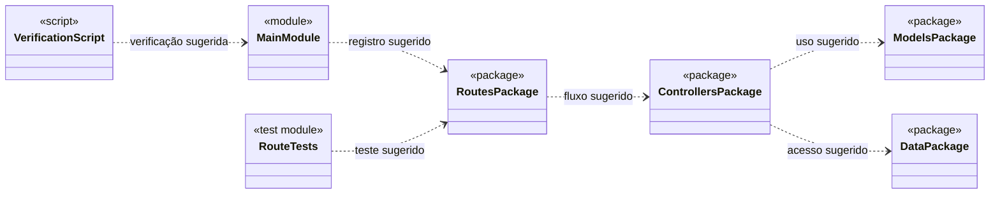

# Doceria API

API para o projeto de doceria. Este repositório ainda está no estágio de estrutura inicial: os arquivos da aplicação, das dependências e dos testes estão vazios. Por isso, não há endpoints, entidades, regras de negócio ou comandos de execução implementados para documentar neste momento.

## Estado atual

- Linguagem identificada pela estrutura do projeto: Python.
- Os pacotes estão organizados em rotas, controllers, models e data.
- `requirements.txt` ainda não declara dependências.
- `main.py`, `testar_rotas.py` e `verificar.py` ainda não possuem implementação.

O diagrama abaixo documenta a organização atual das pastas e uma direção arquitetural sugerida. Os elementos são módulos, não classes já implementadas; atualize o diagrama quando a aplicação e seus modelos forem definidos.

## Diagrama de classes



## Estrutura do projeto

```text
.
├── app/
│   ├── controllers/   # Camada prevista para coordenação das regras da aplicação
│   ├── data/          # Camada prevista para acesso ou preparação de dados
│   ├── models/        # Camada prevista para os modelos do domínio
│   └── routes/        # Camada prevista para as rotas da API
├── main.py            # Ponto de entrada previsto
├── requirements.txt   # Dependências Python do projeto
├── testar_rotas.py    # Arquivo previsto para testes de rotas
└── verificar.py       # Script de verificação previsto
```

As responsabilidades descritas para as pastas são propostas com base em seus nomes; ainda não há código implementado que as confirme.

## Requisitos

- Python 3 instalado.

Ainda não é possível iniciar a API ou executar testes: não há implementação de aplicação, dependências declaradas nem casos de teste. Quando esses componentes forem adicionados, documente aqui a versão de Python suportada, os passos de instalação, o comando para iniciar o servidor e como executar a suíte de testes.