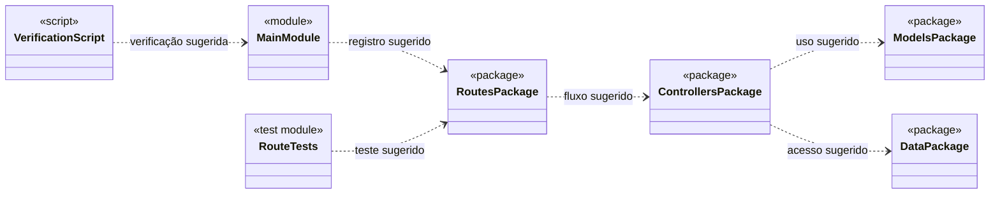

# Doceria API

Backend de uma doceria: cadastro de doces, controle de estoque e registro de
vendas. Construído em quatro camadas (MVC) com FastAPI, seguindo o repositório
modelo [kioferta-python](https://github.com/faustinopsy/kioferta-python).

## Como rodar

```
python -m venv .venv
.venv\Scripts\activate          # Windows
source .venv/bin/activate         # Linux e macOS

pip install -r requirements.txt
uvicorn main:app --reload
```

Abra `http://127.0.0.1:8000/docs`.

```
python verificar.py        # testa models e controllers, sem subir a API
python testar_rotas.py     # testa as rotas (precisa de: pip install httpx)
```

## Estrutura

```
doceria-api/
├── main.py                  liga os módulos à aplicação
├── requirements.txt         fastapi e uvicorn
├── verificar.py             testa models e controllers
├── testar_rotas.py          testa as rotas e os códigos HTTP
└── app/
    ├── data/                dados provisórios (mock), sem classe e sem import
    │   ├── doces_mock.py
    │   └── pedidos_mock.py
    ├── models/              M — classes e regras de negócio
    │   ├── doce.py          Doce + DoceUnidade + DocePorPeso + PERFIS + carregar_doces()
    │   └── pedido.py        Pedido + carregar_pedidos()
    ├── controllers/         C — casos de uso
    │   ├── doce_controller.py
    │   └── pedido_controller.py
    └── routes/              V — endereços HTTP e códigos de resposta
        ├── doce_routes.py
        └── pedido_routes.py
```

Regra de dependência: `main.py → routes → controllers → models → data`.
A seta aponta só para baixo; nenhum arquivo de `models/` conhece o FastAPI.

## Diagrama de classes



Os sinais seguem o enunciado: `-` protegido (um sublinhado no código) e `+`
público; `$` marca constante de classe. A herança é o triângulo vazio
(`<|--`). `Pedido` e `Doce` têm **associação**: o pedido guarda os objetos
`Doce` (com a quantidade vendida), mas um doce existe sem pedido e continua
existindo depois dele — por isso não é composição.

`EstoqueInsuficiente` (em `models/doce.py`) é só um `ValueError` com nome
próprio, para a rota separar 409 de 422. Não é uma classe de domínio.

## Onde estão as regras

| Regra | Onde | Resposta HTTP |
| ----- | ---- | ------------- |
| nome e categoria não podem ser vazios | `Doce.alterar_nome` / `alterar_categoria` | 422 |
| preço precisa ser maior que zero | `Doce.alterar_preco` | 422 |
| estoque não pode ficar negativo | `Doce.alterar_estoque` | 422 |
| quantidade abaixo do mínimo | `Doce.validar_quantidade` | 422 |
| doce por peso só em múltiplos de 50 g | `DocePorPeso.validar_quantidade` (usa `super()`) | 422 |
| tipo de doce desconhecido | `criar_doce` | 422 |
| pedido vazio não pode ser criado | `Pedido.alterar_itens` | 422 |
| venda maior que o estoque | `Doce.verificar_estoque` → `EstoqueInsuficiente` | 409 |
| nome de doce já cadastrado | `DoceController.existe_nome` + rota | 409 |
| doce, pedido ou categoria não encontrados | controller devolve `None` ou lista vazia | 404 |
| cadastro / venda criados | rota | 201 |

A venda é **tudo ou nada**: `Pedido.efetivar()` verifica o estoque de todos os
itens antes de descontar o primeiro.

## Herança e polimorfismo

- **Hierarquia:** `Doce → DoceUnidade, DocePorPeso`.
- **`super()` estendendo:** `DocePorPeso.validar_quantidade` chama a da base
  (mínimo) e acrescenta a regra dos múltiplos de 50 g; `mostrar_descricao`
  também.
- **Constantes de classe diferentes nas filhas:** `UNIDADE_ESTOQUE`,
  `UNIDADE_PRECO`, `DIVISOR_PRECO`, `QUANTIDADE_MINIMA`.
- **Polimorfismo:** `Doce.calcular_subtotal` é uma única conta
  (`preço × quantidade ÷ DIVISOR_PRECO`); o que muda é a constante da classe.
  `Pedido.calcular_total` soma os subtotais sem perguntar o tipo do doce.
- **`PERFIS`:** `{'unidade': DoceUnidade, 'peso': DocePorPeso}` transforma o
  texto do mock na classe, sem `if`.

Doce por unidade: preço por unidade, estoque e venda em `un`.
Doce por peso: preço por **kg**, estoque e venda em **gramas**.

## Rotas

| Método | Rota | Função | Respostas |
| ------ | ---- | ------ | --------- |
| GET | `/api/doces` | Listar os doces | 200 |
| GET | `/api/doces/categoria/{cat}` | Filtrar por categoria | 200, 404 | - "retirado por exceder quantidade de rotas proposta pelo desafio"
| POST | `/api/doces` | Cadastrar um doce | 201, 409, 422 |
| GET | `/api/estoque` | Consultar o estoque | 200 |
| POST | `/api/pedidos` | Registrar uma venda | 201, 404, 409, 422 |
| GET | `/api/pedidos/{id}` | Consultar uma venda e seu total | 200, 404 |
| GET | `/api/pedidos` | Listar as vendas | 200 |
| GET | `/api/relatorio/ticket-medio` | Valor médio das vendas | 200, 404 |

Exemplo de venda (`POST /api/pedidos`), quantidades em `un` ou em gramas:

```
{ "itens": [ { "doce_id": 1, "quantidade": 2 },
             { "doce_id": 6, "quantidade": 250 } ] }
```

## Saída do verificar.py

```
1. Encapsulamento: o objeto nasce valido
  ok      construtor recusa nome vazio
  ok      construtor recusa categoria vazia
  ok      construtor recusa preco zero
  ok      construtor recusa estoque negativo
  ok      nao existe alterar_id

2. Heranca: a hierarquia esta correta
  ok      DoceUnidade herda de Doce
  ok      DocePorPeso herda de Doce
  ok      DocePorPeso sobrescreve validar_quantidade
  ok      as filhas NAO reescrevem calcular_subtotal: herdam

3. Heranca: constante de classe com valor diferente
  ok      UNIDADE_ESTOQUE difere
  ok      QUANTIDADE_MINIMA difere

4. Heranca: super() estende o metodo da base
  ok      super() ainda aplica a regra da base (minimo)
  ok      a filha acrescenta a sua regra (multiplos de 50 g)
  ok      descricao da filha contem a da base + o acrescimo

5. Polimorfismo: o mock vira classes diferentes
  ok      o mock virou objetos das duas filhas
  ok      PERFIS mapeia texto -> classe
  ok      o valor de PERFIS e a propria classe
  ok      tipo desconhecido e recusado

6. Polimorfismo: a mesma chamada, cobrancas diferentes
  ok      4 brigadeiros = R$ 14,00
  ok      250 g a R$ 90/kg = R$ 22,50

7. Estoque: nunca fica negativo
  ok      retirar 4 de 10 deixa 6
  ok      recusa retirar mais do que ha (EstoqueInsuficiente)
  ok      a tentativa falha nao mexe no estoque
  ok      EstoqueInsuficiente e um ValueError

8. Pedido: associacao e regras
  ok      mocks com pelo menos 5 registros
  ok      o pedido guarda objetos Doce, nao ids
  ok      total do pedido 1 = R$ 51,00
  ok      pedido vazio e recusado
  ok      quantidade zero e recusada
  ok      o mesmo doce repetido e somado

9. Venda: verifica e atualiza o estoque
  ok      a venda descontou o estoque do doce por unidade
  ok      a venda descontou o estoque do doce por peso (g)
  ok      total da venda = R$ 80,00

10. Venda: tudo ou nada
  ok      venda sem estoque e recusada
  ok      nenhum item foi descontado quando um falhou

11. Colecoes: filtro e relatorio
  ok      filtro por categoria ignora maiusculas
  ok      categoria inexistente: lista vazia
  ok      pedido inexistente devolve None
  ok      existe_nome ignora caixa e espacos
  ok      ticket medio do historico = R$ 38,75

12. Camadas: a model nao conhece o FastAPI
  ok      doce.py nao importa fastapi
  ok      pedido.py nao importa fastapi

13. Camadas: o controller nao devolve codigo HTTP
  ok      doce_controller.py nao usa HTTP
  ok      pedido_controller.py nao usa HTTP

14. Nenhum if comparando tipo ou nome de classe
  ok      nenhum if de tipo em app/

TUDO CERTO. Agora suba a API e teste no /docs.
```

## Quem fez o quê

| Integrante | Responsabilidade |
| ---------- | ---------------- |
| Gustavo Henrique | models(doce e pedido), testar_rotas.py, veririficar.py |
| Felipe Cunha | controllers |
| Guilherme Henrique |  README e diagrama_ |
| Gabriel dos Santos | routes, data, main.py |
