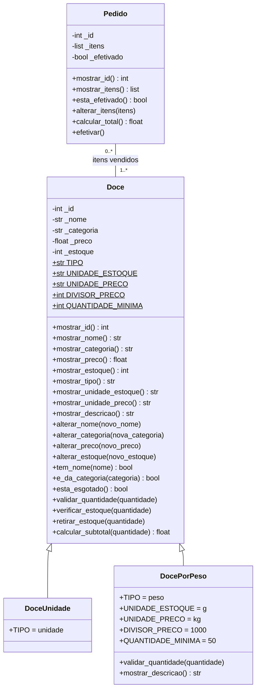

# Doceria API

API REST para cadastro de doces, consulta de estoque e registro de vendas,
desenvolvida em Python com FastAPI. A aplicação organiza o código em rotas,
controllers, models e dados mockados em memória; não há persistência em banco
de dados.

## Funcionalidades

- Listar doces e consultar estoque.
- Cadastrar doces vendidos por unidade ou por peso.
- Registrar pedidos, calcular totais e atualizar o estoque.
- Consultar pedidos e o relatório de ticket médio.
- Aplicar validações de domínio para preços, quantidades, estoque e pedidos.

## Diagrama de classes

Diagrama UML das classes de domínio da **Doceria API** (`app/models/`): `Doce`, `DoceUnidade`, `DocePorPeso` e `Pedido`.

> O diagrama representa as classes implementadas em `app/models/doce.py` e
> `app/models/pedido.py`.

Convenção de visibilidade usada:

- `+` público
- `-` protegido (atributos com um sublinhado no código, como `_nome`)
- `$` constante de classe



## Relações

- **Herança** (triângulo vazio): `DoceUnidade` e `DocePorPeso` herdam de `Doce`. As filhas mudam as constantes de classe; `DocePorPeso` ainda sobrescreve `validar_quantidade()` e `mostrar_descricao()`, chamando `super()`.
- **Associação** `Pedido` — `Doce`:
  - Um `Pedido` tem **1 ou mais** doces (`1..*`): pedido vazio é recusado em `Pedido.alterar_itens()`.
  - Um `Doce` aparece em **0 ou mais** pedidos (`0..*`): um doce pode nunca ter sido vendido.
  - O pedido guarda os próprios objetos `Doce`, junto com a quantidade vendida de cada um. Não é composição, porque o doce existe sem o pedido e continua existindo depois dele.

## Estrutura do projeto

```text
doceria-api/
├── main.py
├── requirements.txt
├── verificar.py
├── testar_rotas.py
└── app/
    ├── data/
    │   ├── doces_mock.py
    │   └── pedidos_mock.py
    ├── models/
    │   ├── doce.py
    │   └── pedido.py
    ├── controllers/
    │   ├── doce_controller.py
    │   └── pedido_controller.py
    └── routes/
        ├── doce_routes.py
        └── pedido_routes.py
```

Fluxo das dependências: `main.py → routes → controllers → models → data`.
Os models contêm as regras de domínio e não dependem do FastAPI.

## Como executar

Requer Python 3.9 ou superior.

```powershell
python -m venv .venv
.venv\Scripts\activate
pip install -r requirements.txt
uvicorn main:app --reload
```

Em Linux ou macOS, ative o ambiente virtual com `source .venv/bin/activate`.
Com a API em execução, acesse `http://127.0.0.1:8000/docs` para explorar e
testar os endpoints pela documentação interativa.

## Endpoints

| Método | Rota | Descrição |
|---|---|---|
| `GET` | `/api/doces` | Lista os doces cadastrados. |
| `POST` | `/api/doces` | Cadastra um doce. |
| `GET` | `/api/estoque` | Consulta o estoque. |
| `GET` | `/api/pedidos` | Lista os pedidos. |
| `GET` | `/api/pedidos/{id}` | Consulta um pedido. |
| `POST` | `/api/pedidos` | Registra uma venda e atualiza o estoque. |
| `GET` | `/api/relatorio/ticket-medio` | Consulta o ticket médio das vendas. |

Exemplo de corpo para `POST /api/doces`:

```json
{
  "nome": "Brigadeiro",
  "categoria": "Doces",
  "tipo": "unidade",
  "preco": 3.5,
  "estoque": 100
}
```

Exemplo de corpo para `POST /api/pedidos` (quantidade em unidades ou gramas,
conforme o tipo do doce):

```json
{
  "itens": [
    { "doce_id": 1, "quantidade": 2 },
    { "doce_id": 6, "quantidade": 250 }
  ]
}
```

## Verificações

```powershell
python verificar.py
python testar_rotas.py
```

O teste de rotas usa o `TestClient` do FastAPI e requer `httpx`, que pode ser
instalado com `pip install httpx`. Os dados de doces e pedidos vêm de mocks e
ficam em memória durante a execução; reiniciar a aplicação restaura os dados
iniciais.